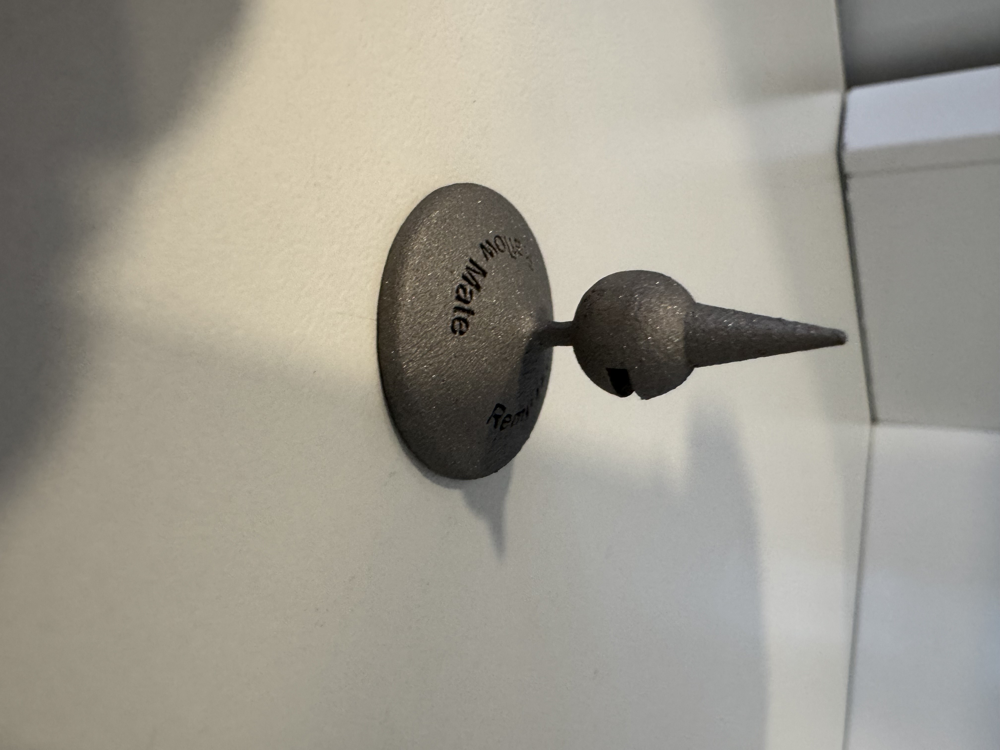

# ReflowMate

Just a simple tool (3D metal printing test for other project) to help me reflow both sides of the PCB. I used ordinary screws before, but it was an unstable situation in my Cif FT03 oven (while closing the drawer).

The sleeves can be used to attach the break away part of the panel (photo is not the best example) and the conus can be used for mounting holes or tooling holes.

I used PCBWAY for 3D printing:

- CNC | 3D printing (upper menu website)
- 3D printing
- Quantity per 5 (The initial mentioned price was reduced a lot after review by PCBWAY, takes some time)
- Tool steel (or whatever you like, but Titanium is VERY expensive)
- At other special request you can ask for polishing
- Delivered in The Netherland after 10 days

